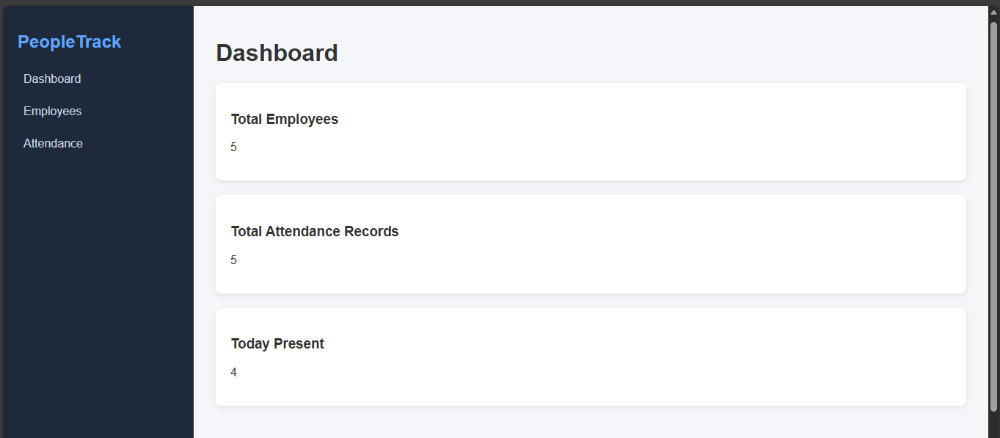
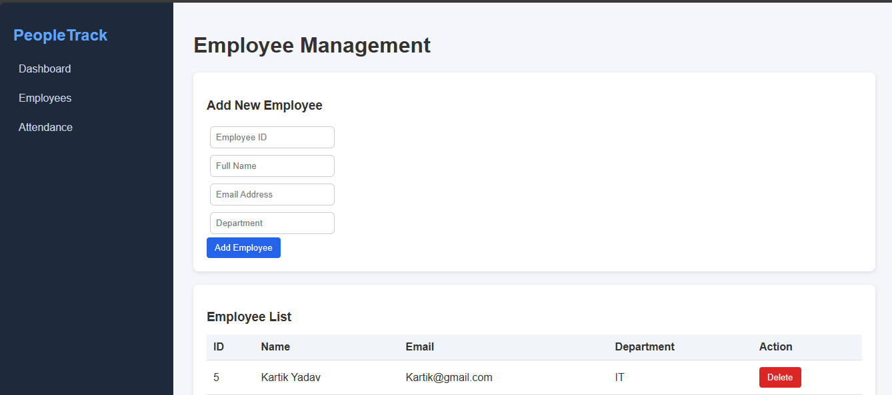
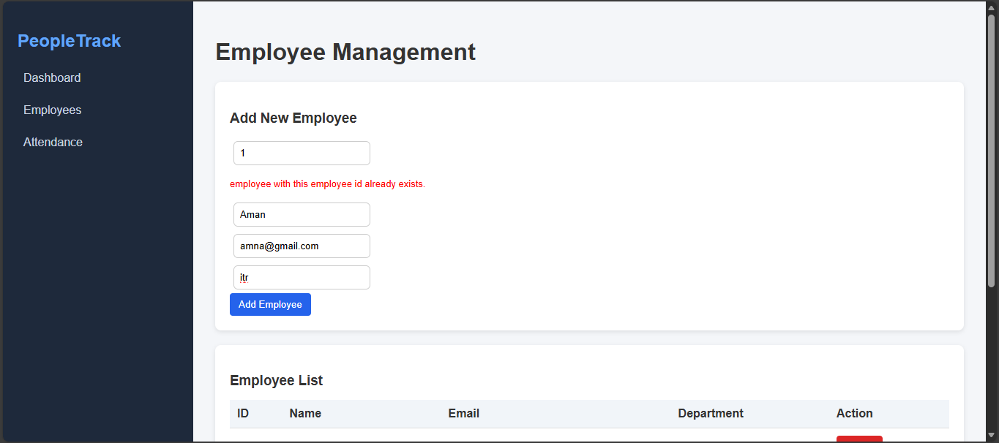
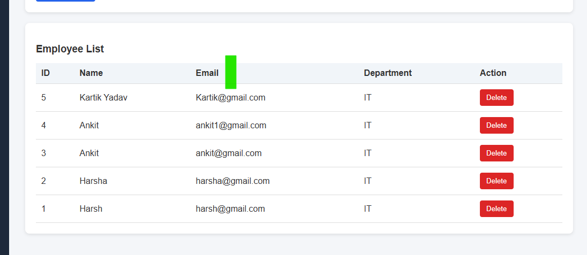
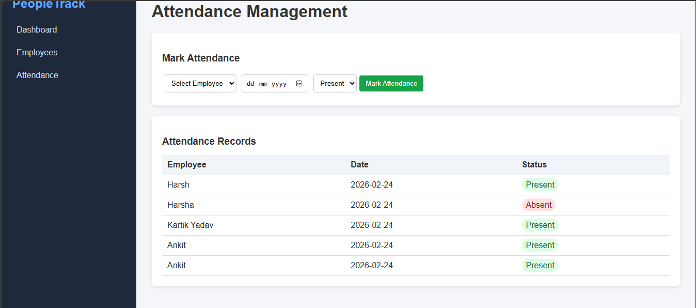

# 🚀 PeopleTrack - Employee & Attendance Management System

PeopleTrack is a full-stack Employee & Attendance Management System built using **Django REST Framework (Backend)** and **React (Vite) (Frontend)**.

---

## 🌍 Live Links

🔹 Frontend (Vercel)  
https://peoplestrack-m2ru.vercel.app/

🔹 Backend (Render API)  
https://peopletrack.onrender.com/

🔹 GitHub Repository  
https://github.com/harsh7983-debug/peoplestrack

---

# 📌 Project Overview

PeopleTrack allows organizations to:

- Manage employees
- Track daily attendance
- View dashboard statistics
- Prevent duplicate employee ID & email entries
- Mark attendance as Present / Absent
# ✨ Features

## 🔹 Core

### 📊 Dashboard
- Total Employees count
- Total Attendance Records
- Today's Present Count
- Real-time API-powered stats

### 👨‍💼 Employee Management
- Add new employee
- Unique Employee ID validation
- Unique Email validation
- View employee list
- Delete employee (with proper handling)

### 📅 Attendance Tracking
- Mark attendance (Present / Absent)
- Select attendance date
- View attendance records
- Linked to employee records

---
---
## 🔹 UX Features

- Real-time API integration
- Clean card-based UI
- Proper loading & error handling
- Responsive layout
- RESTful architecture

---
# 🛠 Tech Stack

## Frontend
- React 18
- Vite
- React Router
- Axios
- CSS
- Vercel (Deployment)

## Backend
- Django
- Django REST Framework
- SQLite (Production on Render)
- Gunicorn
- Render (Deployment)

---

# 📁 Project Structure

```
peoplestrack/
├── backend/
│   ├── peopletrack_backend/
│   │   ├── settings.py
│   │   ├── urls.py
│   │   └── wsgi.py
│   ├── hr/
│   │   ├── models.py
│   │   ├── serializers.py
│   │   ├── views.py
│   │   ├── urls.py
│   │   └── migrations/
│   ├── manage.py
│   └── requirements.txt
│
├── frontend/
│   ├── src/
│   │   ├── services/        # Axios API config
│   │   ├── pages/           # Dashboard, Employees, Attendance
│   │   ├── components/      # Reusable UI components
│   │   └── App.jsx
│   ├── package.json
│   └── vite.config.js
│
├── screenshots/
└── README.md
```

Environment Variable used in frontend:

```
VITE_API_BASE_URL=https://peopletrack.onrender.com
```

---

# 📊 Application Screenshots

## 📈 Dashboard

Shows:
- Total Employees
- Total Attendance Records
- Today Present Count



---

## 👨‍💼 Add Employee

Add new employee with:
- Employee ID
- Name
- Email
- Department



---

## ❗ Duplicate Validation

Prevents:
- Duplicate Employee ID
- Duplicate Email



---

## 📋 Employee List

- Displays all employees
- Delete option available



---

## 📅 Attendance Management

- Select employee
- Select date
- Mark Present / Absent
- View attendance records



---

# 🔌 API Endpoints

Base URL:

https://peopletrack.onrender.com/api/

| Method | Endpoint | Description |
|--------|----------|------------|
| GET | /api/employees/ | List Employees |
| POST | /api/employees/ | Add Employee |
| DELETE | /api/employees/{id}/ | Delete Employee |
| GET | /api/attendance/ | List Attendance |
| POST | /api/attendance/ | Mark Attendance |
| GET | /api/dashboard/ | Dashboard Summary |

---

# ⚙️ Local Setup

## 1️⃣ Clone Repository

```
git clone https://github.com/harsh7983-debug/peoplestrack.git
cd peoplestrack
```

---

## 2️⃣ Backend Setup

```
cd backend
python -m venv venv
venv\Scripts\activate
pip install -r requirements.txt
python manage.py migrate
python manage.py runserver
```

Backend runs on:
http://127.0.0.1:8000/

---

## 3️⃣ Frontend Setup

```
cd frontend
npm install
npm run dev
```

Create `.env` file inside frontend:

```
VITE_API_BASE_URL=http://127.0.0.1:8000
```

Frontend runs on:
http://localhost:5173/

---

# 🚀 Deployment Details

## Frontend
- Hosted on Vercel
- Root Directory: `frontend`
- Node Version: 20.x
- Output Directory: `dist`

## Backend
- Hosted on Render
- Production Mode Enabled
- CORS Configured

---

# 🔐 Production CORS Configuration (Django)

```
CORS_ALLOWED_ORIGINS = [
    "https://peoplestrack-m2ru.vercel.app",
]

CSRF_TRUSTED_ORIGINS = [
    "https://peoplestrack-m2ru.vercel.app",
]
```

---
# ⚠️ Assumptions & Limitations

- SQLite is used for simplicity (production database upgrade recommended)
- No authentication system implemented (can be extended with JWT)
- No pagination implemented (can be added easily)
- No role-based access control

---
# 🎯 Future Improvements

- JWT Authentication
- Role-Based Access
- Pagination
- Search & Filtering
- PostgreSQL Integration
- Docker Support
- Charts & Analytics

---

# 👨‍💻 Author

Aman 
GitHub: https://github.com/harsh7983-debug

---
